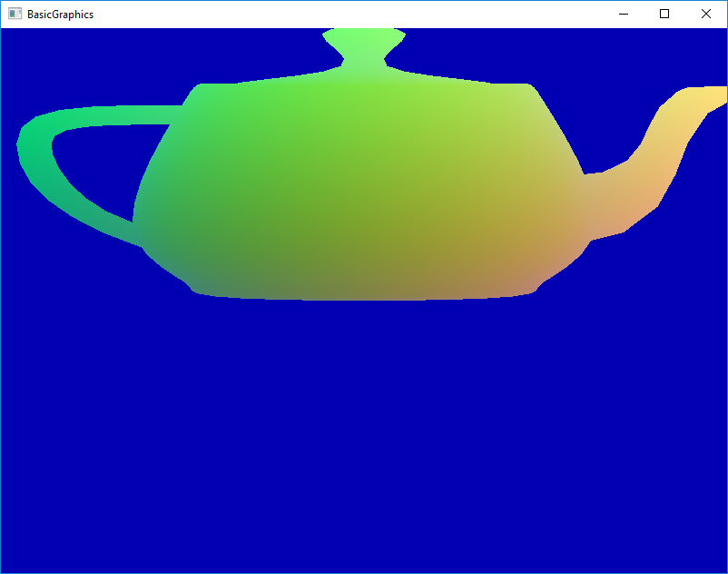
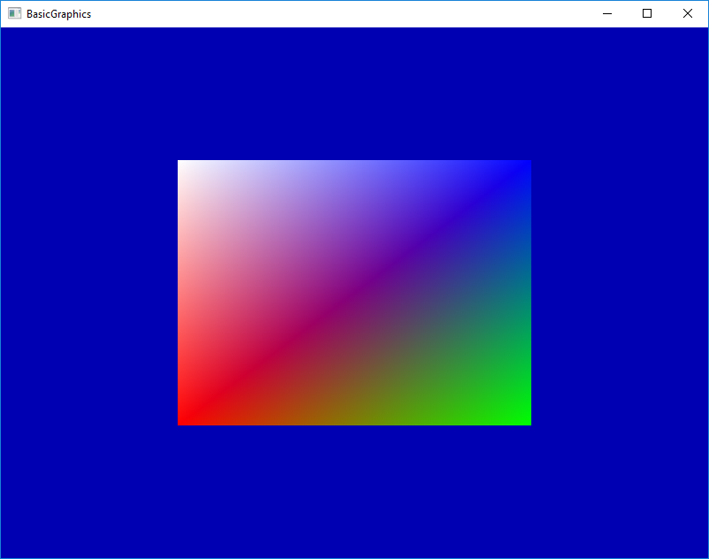

BasicGraphics
=============

This is a very basic OpenGL sample  

## Dependencies

The following dependencies need to be installed:

- OpenGL
- GLFW
- GLEW
- GLM
- Assimp
- stb_image
- stb_image_write

The shaders are set up to work with OpenGL version 3.3.

## Command Line Arguments

The program can optionally take one command line parameter.

If provided, it will load the appropriate 3D model and display it.  Colors are overriden to be proportional to the vertex position.

Example: ../sampleModels/teapot.obj:

If not provided, it will create a generic quad with red, green, blue, and white corners.

## Keyboard Commands

- ESC = exits program
- Spacebar = prints "SPACEBAR" as long as key is down
- W = prints "W" as long as key is down
- A = prints "A" as long as key is down
- S = prints "S" as long as key is down
- D = prints "D" as long as key is down

## Mouse Input

- Left mouse button pressed = prints "MOUSE LEFT DOWN" as long as mouse button is down
- Left mouse button released = prints "MOUSE LEFT UP" once
- Mouse moves = prints current mouse position in pixels relative to window

## Model Credits

Utah teapot model taken from: http://goanna.cs.rmit.edu.au/~pknowles/models.html

